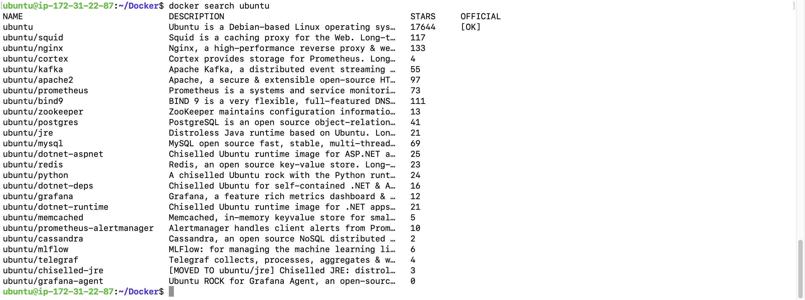
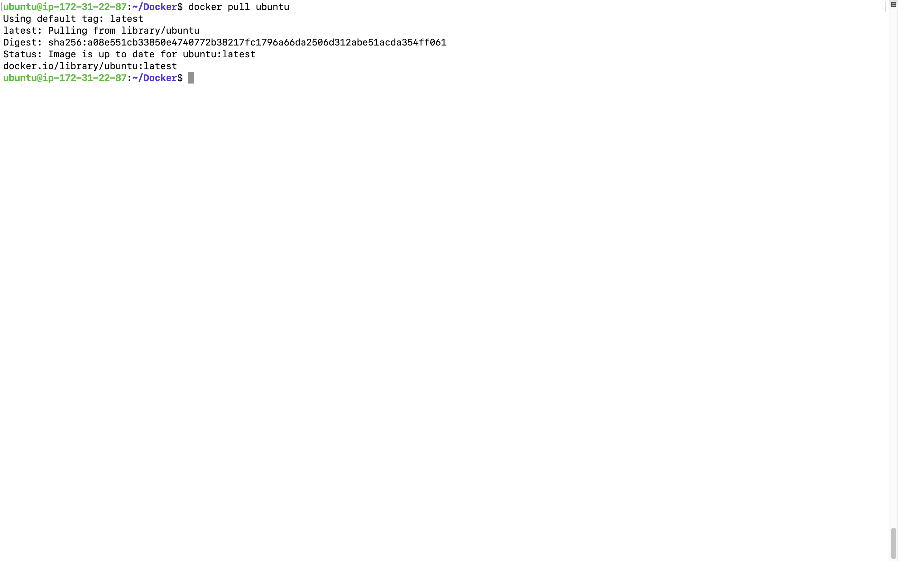
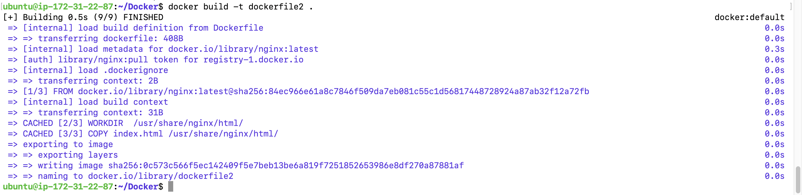
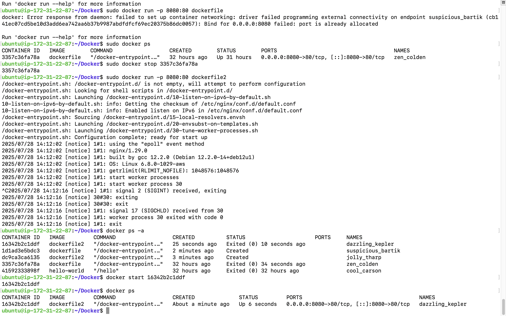
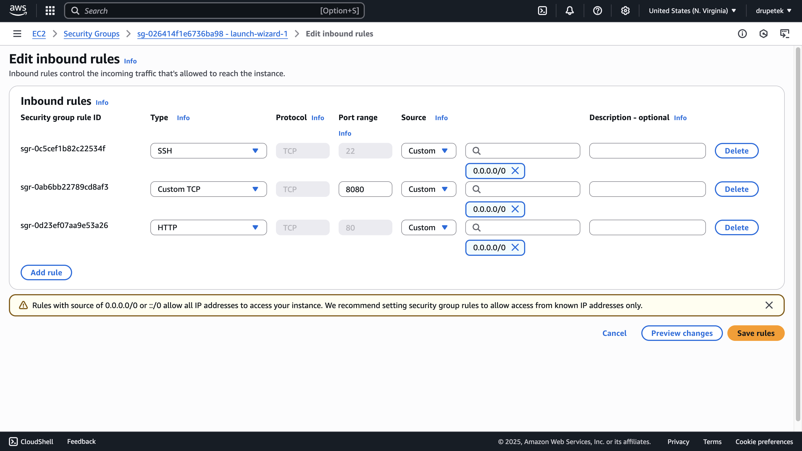
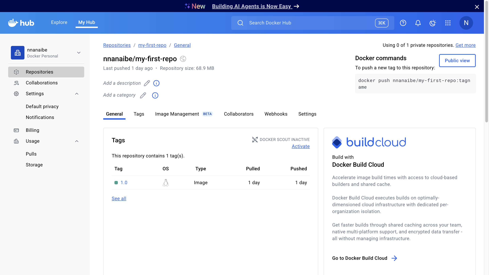
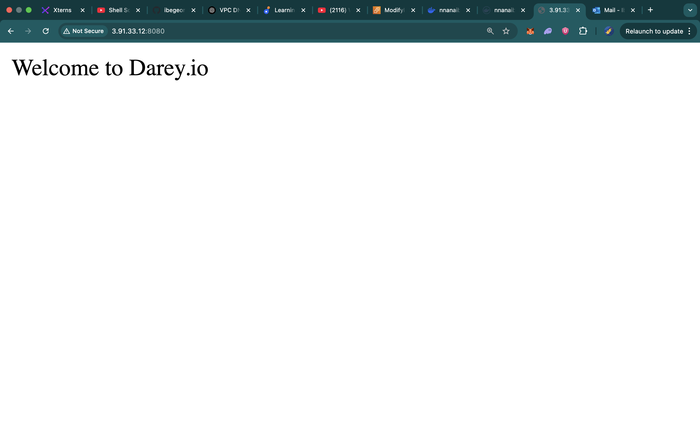

# 🐳 Docker Mini Project

This project is a hands-on demonstration of Docker fundamentals, including:

- Pulling Docker images from Docker Hub  
- Creating a custom Docker image using NGINX and a simple HTML page  
- Running containers  
- Pushing Docker images to Docker Hub  

---

## 📥 Pulling Image from Docker Hub

### 1. Search for the Image

To search for available images, I ran the command:

```bash
docker search ubuntu
```

### 2. Pull the Image

To pull the image from Docker Hub:

```bash
docker pull ubuntu
```

## 🛠️ Creating a Docker Image

### 3. Step-by-Step:

1. I created a folder named `docker-mini-project`.

2. Inside the folder, I created two files: `index.html` and `Dockerfile`.

3. The `index.html` file contained the following:

```html
Welcome to Darey.io
```
### 📝 Dockerfile

The `Dockerfile` contained the following instructions:

```Dockerfile
# Use the official NGINX base image
FROM nginx:latest

# Set the working directory in the container
WORKDIR /usr/share/nginx/html/

# Copy the local HTML file to the NGINX default public directory
COPY index.html /usr/share/nginx/html/

# Expose port 80 to allow external access
EXPOSE 80

# No need for CMD as NGINX image comes with a default CMD to start the server
```

### 🔨 Building the Image

1. Navigate to the directory containing the `Dockerfile`.

2. Run the command:

```bash
docker build -t dockerfile .
```

### ▶️ Running the Docker Container

To start the container and map it to port `8080`:

```bash
docker run -p 8080:80 dockerfile
```

### Verifying AWS Security Group Settings


### 📤 Pushing Docker Images to Docker Hub

1. First, I logged into Docker Hub via the terminal:

```bash
docker login -u <docker-username>
```
2. Then I tagged my docker image
```bash
   docker tag <image_name> <docker_username>/<repository_name>:<tag>
```
3. I pushed the tagged image to Docker Hub
```bash
docker push <docker_username>/<repository_name>:<tag>
```
4. After pushing, I verified the image was successfully uploaded by visiting my Docker Hub repository.
   
### Loading the Webpage
I loaded the webpage by searching the pubilic ip of by aws instance and adding the 8080 port 

